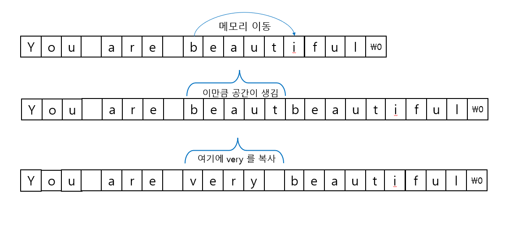

# 문자열 함수

## 문자열 복사

c언어에서 문자열은 널 종료 문자가 끝에 있는 문자 배열로 표현하며 기본 타입에 포함되지 않는다.
정수나 실수와 같은 기본 타입으로 인정되지 않기 때문에 컴파일러가 제공하는 = , == , + , - 등의
기본적인 연산자를 자유롭게 사용할 수 없다. str1 , str2 , str3 가 문자형 배열일 때 다음 코드는
모두 동작하지 않는다. 

```c
str = "Korea" // 문자열 상수를 대입할 수 없음
str1 =str2; // 배열끼리도 대입할 수 없음
str3 = str1 + str2; // + 연산자로 문자열을 연결할 수 없음
if (str1 == str2) // == 연산자로 문자열끼리 비교할 수 없음
```

char str[10]; 으로 문자형 배열을 선언하고 이 배열에 "korea" 라는 문자열 상수를 대입하고 싶으면
char str[10] = "korea"; 로 선언할 때 초기화해야 한다.

일단 선언되면 str = "korea"; 로 대입할 수 없으며 str = "china"; 로 내용을 바꿀 수도 없다.
그러나 선언 후 문자열을 대입하거나 내용을 바꾸어야 할 필요는 분명히 있으며 컴파일러가 이런 지원을 하지
않을 리가 만무하다.

이런 기능을 제공하는 것이 바로 문자열 함수들이다. 문자열이 기본 타입이 아니다 보니 정수나 실수처럼
연산자를 사용할 수는 없지만 문자열 함수를 사용하면 내용을 바꾸거나 비교, 연결하는 것은 물론이고
검색, 변환 등 연산자보다 훨씬 더 다양한 작업을 효율적으로 처리할 수 있다. 


문자 배열에 문자열을 복사하는 함수 

### `char *strcpy(char *dest , const char *src);`

문자 배열의 내용을 변경하므로 정수나 실수의 대입 연산자에 해당한다고 할 수 있다. 
const 는 함수가 인수의 내용을 바꾸지 않는다는 뜻이다.


함수 이름 strcpy는  String Copy의 준말이므로 문자열 복사 함수라는 것을 쉽게 알 수 있다. 

```c
char str[10];
strcpy(str, "korea");
```

```c
char str1[] = "Programmer";
char str2[11];
strcpy(str2, str1);
```

원래 배열의 끝 점검을 하지 않는 C언의 특성상 strcpy 함수도 인수로 주어진 문자 배열의 끝 점검을
하지 않으며 이 배열의 크기가 얼마인지도 모른다. 그래서 strcpy 함수로 문자열을 복사할 때는 항상
dest 가 src의 문자열을 대입받을만한 충분한 크기를 가지도록 해야 한다. 
물론 널 종료 문자도 배열 크기에 당연히 포함시켜야 한다.

위 예에서 보듯이 "korea"  문자열을 복사받을 배열은 최소한 6바이트 이상 되어야 하며 "Programmer"
라는 10문자를 저장할 배열은 최소한 11바이트 이상이어야 한다. 
모자라는 것은 문제가 되지만 남는 것은 상관 없으므로 문자열을 저장할 배열은 항상 크기를
넉넉하게 잡는 것이 좋다. 다음과 같이 배열의 길이가 충분하지 않을 경우  strcpy는 배열 뒤쪽의
메모리까지 덮어써 버릴 것이다.

```c
char str[3];
strcpy(str , "korea");
```

str은 문자 3개를 저장할 수 있는 공간밖에 가지고 있지 않는데 이 좁은 공간에 "korea"라는 다섯 개의
문자와 널 종료 문자까지 복사했으므로 str에 인접해 있는 다른 변수가 파괴된다. 만약 이 메모리에 
변수가 아닌 더 중요한 정보가 저장되어 있으면 프로그램이 다운되는 치명적인 에러가 된다.


strcpy 함수는 src 문자열 전체를 널 종료 문자를 만날 때 까지 dest로 복사한다.

그에 반해 다음 함수는 지정한 길이 만큼만 복사한다.

### `char *strncpy(char *dest , const char *src ,size_t_ count);`


```c
#include "stdio.h"
#include "string.h"

int main(void)
{
    char str1[] = "parkgeonhee";
    char str2[] = "conypark";
    strcpy(str1 , str2);
    puts(str1); // conypark
    // 문자열 널 종료 까지 복사 되므로 나머지 뒤에 hee는 출력되지 않음

    char str3[] = "abcdefghi";
    char str4[] = "123456789";
    strncpy(str4, str3 ,3);
    puts(str3); // abc3456789
}
```


만약 count가 src 문자열의 길이보다 더 길다면 널 문자 이후는 모두 널 문자로 채워진다. 

```c
char str1[] = "abcd";
char str2[] = "123456789";
strncpy(str2 , str1 , 10);
puts(str2); // abcd
```


만약 문자열 시작 부분이 아니라 중간의 일부를 바꾸고 싶다면 복사할 시작 위치를 옮기면 된다.

```c
strncpy(str2+2,str1+2,3);
```

```c
#include "stdio.h"
#include "string.h"

int main(void)
{
    char str[] = "cony is genius";
    strncpy(str+8,"hero" , 5);
    puts(str); // cony is hero
}
```

### `size_t strlen(const char *string);`

문자열 길이를 조사하는 strlen 함수

문자열의 길이란 문자열 시작 번지에서 부터 싲가해서 널 종료 문자까지 들어 있는 문자의 개수를 의미한다.
널 종료 문자는 문자열의 끝을 나타낼뿐 묹열의 일부가 아니므로 개수에는 제외된다.

```c
#include "stdio.h"
#include "string.h"

int main(void)
{
    char str1[10] ="abcd";
    int len = strlen(str1);
    printf("%d  \n",len); // 4

    char str2[10] = "박건희";
    len = strlen(str2);
    printf("%d \n",len); // 9

    char str3[10] = "코니";
    len = strlen(str3);
    printf("%d \n",len); // 6
}

```

한글은 3바이트 차지하며  각각의 길이는 위와 같다.


## 문자열 연결

## 메모리 관리 함수

문자열과 메모리는 연속된 공간이라는 점에서 공통점이 있기 때문에 메모리 관리 함수들의 동작도
문자열 관리 함수들과 비슷하다. 

동작이 비슷하다 보니 함수 이름과 원형도 거의 같다. 

```c
void *memcpy(void * dest , const void *src , size_t count);
int memcmp(const void *buf1, const void *buf2, size_t count);
void *memchr(const void *buf , int c, size_t count);
void *memset(void *dest , int c , size_t count);
void *memmove(void *dest , const void *src , size_t count);
```

메모리 관리 함수들과 문자열관리 함수들의 차이점

1. 인수와 리턴 값의 타입이 다르다. 문자열 관리 함수들은 항상 문자열을 대상으로 하므로 취하는 인수나 리턴 값이
대부분 char* 형이지만 메모리 조작 함수들은 임의이 값을 대상으로 하기 때문에 인수와 리턴값이 모두 void* 형이다.
이 함수들은 시작 번지만 알려주면 바이트 단위로 작업을 하므로 메모리에 저장된 값의 타입을 몰라도 상관없으며
임의의 타입에 대해서도 잘 동작한다.


2. 문자열은 시작 번지만 알려 주면 널 종료 문자를 끝으로 인식하기 때문에 길이를 별도로 알려줄 필요가 없다.
하지만 메모리 관리 함수는 길이를 알려 주지 않으면 어디까지가 작업 대상인지를 알지 못한다. 
그래서 모든 함수의 끝에 작업 대상 메모리의 길이를 지정하는 count 라는 인수가 있다. 메모리까지
복사하는 memcpy 함수는 strcpy 함수보다는 strncpy 함수와 유사하다고 볼 수 있다. 


### `memmove 함수`

이 함수는 메모리의 내용을 지정한 길이만큼 다른 곳으로 옮긴다. 이 함수를 사용하면 배열 중간을 뒤쪽으로 밀어서
빈 공간을 만든 후 그 공간에 다른 내용을 삽입해 넣을 수 있다. 

```c
#include "stdio.h"
#include "string.h"

int main(void)
{
    char str[32] = "You are beautiful";
    char str2[] = "very ";
    memmove(str+13, str+8,10);
    memcpy(str+8,str2, strlen(str2));
    puts(str);
}
```

str[8] 이하에 있는 길이 10(널 문자 포함)의 "beautiful"을 str[13]으로 옮기면
중간에 5바이트가  비게 된다. 이 빈자리에 "very"를 복사해 넣는다.



원본이 삭제된느 것은 아니고 복사된다.

