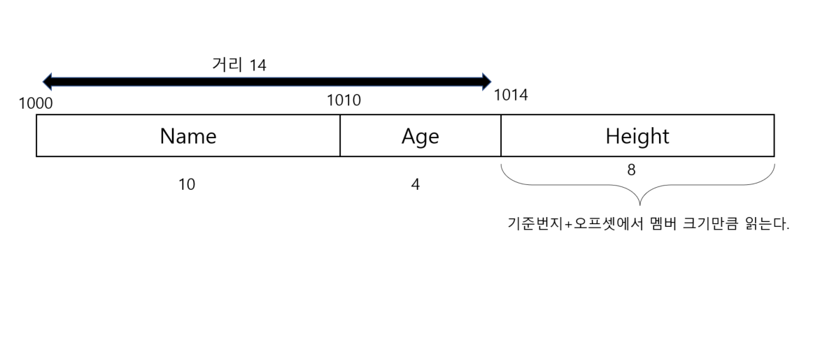
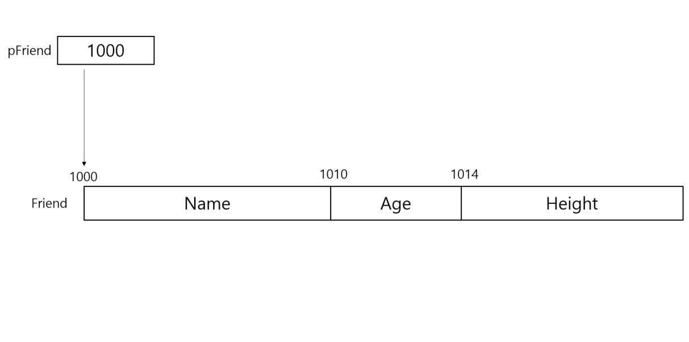

# 멤버의 참조

## 멤버 연산자

같은 타입의 변수 집합인 배열을 참조할 때는 [ ] 연산자와 첨잘르 사용한다. [ ] 연산자 안에
참조하고자 하는 배열 요소의 번호인 첨자만 적으면 배열 요소를 읽거나 쓸 수 있다. 

```c
int ar[5];
ar[3] = 1;
```

배열 요소를 참조하는 방식이 이렇게 단순한 이유는 배열을 구성하는 모든 요소의 크기가 일정하고
서로 인접해 있기 때문이다. 그래서 단순히 "몇 번째 것" 이라는 순서만 지정하면 
첨자 연산 (포인터와 정수의 덧셈 그리고 * 연산자의 합작 연산)에 의해 원하는 배열 요소를 
신속하고 정확하게 찾을 수 있다. 

그러나 구조체의 멤버는 타입이 제각각 다르며 크기도 다르다. 따라서 구조체에 속한 멤버를 읽을 때는
"첫 번째 멤버" 나 "두 번째 멤버" 따위의 순서값을 사용할 수 없으며 별도의 연산자와 멤버의 이름을
사용해야 한다.

```c
#include "stdio.h"
#include "string.h"
struct tag_Friend
{
    char Name[10];
    int Age;
    double Height;
};

int main(void)
{
    struct tag_Friend Friend; // 태그로 부터 Friend 라는 이름의 구조체 변수 선언
    strcpy(Friend.Name , "cony");
    Friend.Age = 29;
    Friend.Height = 169.4;

    printf("name = %s , age = %d , height = %.1f\n ", Friend.Name , Friend.Age, Friend.Height);
}
 
```

구조체 변수는 멤버들의 집합이며 메모리에 생성될 때 선언된 멤버가 순서대로 할당된다.
Friend 구조체는 다음과 같은 모양을 가지며 메모리 상의 위치는 실행할 때마다 달라지지만
편의상 1000번지에 생성되었다고 하자.



오프셋은 구조체의 시작 번지에서 멤버까지의 거리인데 이 값은 자기 보다 앞에 있는 멤버들의 크기의
총합과 같다. 

컴파일러는 구조체가 선언될 때 각 멤버의 오프셋과 타입을 기억해 둔다. 그리고 멤버를 
참조하는 문장을 만나면 구조체의 시작 번지에서 오프셋을 더한 만큼 이동한 후 이 위치에서
멤버의 타입 길이만큼 값을 읽도록 코드를 생성할 것이다.
이런 동작을 하는 연산자가 바로 .연산자이다.

## 포인터 멤버 연산자

T 타입이 있을 때 T형 배열과 T형 포인터를 언제든지 선언할 수 있다. 
그러므로 구조체에 대해서도 배열과 포인터를 선언할 수 있다. tag_Friend 형 구조체 포인터를
선언 및 초기화 해보자

```c
tag_Friend Friend;
tag_Friend *pFriend;
pFriend = &Freind;
```

Friend 구조체를 먼저 생성하고 이 구조체를 가리킬 수 있는 pFriend 포인터 변수를 선언한 후
여기에 Friend의 번질르 대입했다. 이 상태에서 pFriend 포인터가 가리키는 구조체의 멤버를
참조하고 싶을 때는 다음과 같이 한다.

```c
(*pFriend).Age = 30;
```

pFriend 가 Friend 를 가리키고 있으므로 *연산자로 이 포인터가 가리키는 곳을 참조하면
곧 Friend 가 된다. (*pFriend)는 곧 Friend와 같으며 따라서 위 연산문은 Friend.Age = 30과
같다고 할 수 있다. 



*pFriend 연산문은 1000 번지에 있는 tag_Friend 형의 구조체를 먼저 읽으며 다음으로 멤버 연산자에 의해
이 번지의 오프셋 10에 저장된 Age 멤버를 읽는다. pi가 i를 가리키고 있을 때 *pi가 곧 i와 같은 것처럼
*pFriend 는 Friend 와 같으므로 *pFriend 에 대해 멤버 연산자를 사용하는 것은 지극히 정상적인 문법이다.

포인터 멤버 연산자 -> 는 좌변에 구조체 포인터 , 우변에 멤버 이름을 취하며 포인터가 가리키는
번지에 저장된 구조체의 멤버를 읽는 연산을 한다. 그래서 (*pFriend).Age 를 이 연산자로 
고쳐 쓰면 pFriend -> Age 가 된다. 


### `p가 구조체를 가리키는 포인터이고 m이 멤버 일때 (*p).m 은 p -> m 과 같다`

```c
#include "stdio.h"
#include "string.h"

struct tag_Friend {
    char Name[10];
    int Age;
    double Height;
};

int main(void)
{
    struct tag_Friend Friend;
    struct tag_Friend *pFriend;
    pFriend = &Friend;
    strcpy(pFriend -> Name , "cony");
    pFriend -> Age = 30;
    pFriend -> Height = 178.3;

    printf("name = %s , age =  %d , height = %.1f\n" , pFriend->Name , pFriend->Age , pFriend->Height);
}
```

## 구조체 배열

배열의 요소가 될 수 있는 타입에는 제한이 없다. 따라서 구조체도 배열의 요소가 될 수 있으며
구조체 배열을 정의하는 것이 가능하다. 

구조체를 구성하는 멤버는 타입이 모두 다르지만 배열을 구성한느 요소는 모두 구조체라는 같은 타입이므로
배열이 될 수 있다.

## 중첩 구조체

중첩 구조체란 다른 구조체를 멤버로 포함하는 구조체이다. 
구조체의 멤버가 될 수 있는 타입에는 제한이 없으므로 구조체도 다른 구조체의 멤버가 될 수 있다.

