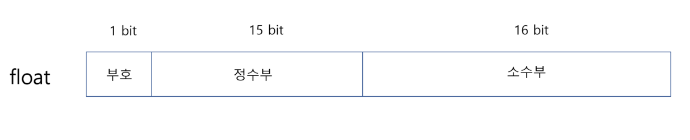

# 타입

## 정수의 내부

변수가 기억할 수 있는 최대 표현 범윌르 넘어설 경우를 오버프로우(Overflow) 라고 하는데
오버플로우가 발생하면 변수는 초과된 값을 기억하지 못하고 엉뚱한 값을 가지게 된다.

```c
#include "bits/stdc++.h"

int main()
{
    unsigned short us;

    us = 65535;
    printf("us = %d \n",us);
    us++;
    printf("us = %d \n",us);
    
}
```

```c
us = 65535
us = 0
```

## 음수의 표현
- 일정수 감소법
- 부호 비트와 절대 값
- 1의 보수법
- 2의 보수법

보수(Complement) 란 어떤 수가 되기 위해 보충되어야 하는 수를 의미함

## 바이트 순서

- 빅 엔디안(Big Endian : 순워드) : 이 방식은 높은 자리수를 먼저 저장한다. 0x12가 가장 앞쪽 바이트에,
그리고 0x34가 그 다음 바이트에 저장되는 식이다. 모토롤라 계열의 CPU와 대부분의 RISC CPU가 이 방식을
사용한다. 사람들은 오랫ㅅ동안 글을 읽을 때 왼쪽에서 오른쪽으로 읽어 왔으므로 읽는 순서에 맞게 4바이트를
나누어 저장한 것이다. 메모리에 나타난 순서대로 읽을 수 있고 자연스러우며 이해하기 쉽다.
- 리틀 엔디안(Little Endian : 역워드) : 이 방식은 낮은 자리수를 먼저 저장한다. 가장 뒤쪽 바이트인
0x78이 메모리의 가장 앞쪽 바이트에 저장되며 그 다음에 0x56이 , 그리고 0x12는 가장 뒤쪽에 저장된다.
인텔 계열의 CPU와 DEC의 알파칩이 이 방식을 사용한다. 메모리의 값을 읽을 때 거꾸로 읽어야 하므로 사람이
직접 읽기에는 다소 불편한 면이 있지만  기계가 값을 다루기는 더 효율적이고 몇 가지 연산에서 편리한 점이 있다.


```c
#include "bits/stdc++.h"

int main()
{
    int i = 0x12345678;
    char * p = (char *)&i;

    // 빅 엔디안
    for (int j = 0; j < sizeof(int); ++j) {
        printf("%x ",p[j]); // 78 56 34 12
    }

    putchar('\n');
    
    // 리틀 엔디안
    for (int j = sizeof(int)-1; j >= 0 ; --j) {
        printf("%x ",p[j]); // 12 34 56 78
    }

    putchar('\n');
}
```

## 부동 소수점

실수는 소수점 이하의 수를 가지기 때문에 정수에 비해 훨씬 더 복잡하다.


|고정 소수점 방식 | 부동 소수점 방식 |
|:----|:----|
|123.456 | 1.2345 * 10 <sup>2</sup>
|0.0123 | 1.23 * 10 <sup>-2</sup>
|1.2345 | 1.2345 * 10 <sup>0</sup>



가수는 실수의 실제값을 표현하며 지수는 크기를 표현하여 가수의 어디쯤에 소수점이 있는지를 나타낸다.
지수의 값에 따라 소수점이 움직이기 때문에 이 방식으로 실수를 표현하는 방법은 부동 소수점이라고 한다.

```c
#include "bits/stdc++.h"

void printFloat(float f) {
    unsigned t;
    char temp[35];
    char bin[35];

    // 비트를 다루기 쉽도록 정수형 변수에 대입한다.
    t = *(unsigned *) &f;

    // 선행 제로를 포함한 32자리의 2진수 문자열로 반환
    itoa(t, bin, 2);
    memset(temp, '0', 35);
    strcpy(temp + 32 - strlen(bin), bin);

    // 부호, 지수 다음에 공백을 하나씩 넣음
    bin[0] = temp[0];
    bin[1] = ' ';
    strncpy(bin + 2, temp + 1, 8);
    bin[10] = ' ';
    strcpy(bin + 11, temp + 9);

    printf(" 실수  = %f(%s). ", f, bin);

    // 지수 출력
    printf("지수부 = %d\n", (t >> 23 & 0xff) - 127);

}

int main() {
    printFloat(0.375f);
    printFloat(3.14f);
    printFloat(-0.5f);
    printFloat(0.1f);
}

```

## 구조체의 정렬

```c
#include "bits/stdc++.h"

struct tag_st1
{
    char c;
    double d;
};

tag_st1 st1 = {'A',1.234};

int main()
{
    printf("addr = %p , &c = %p , &d = %p , size = %d\n" ,&st1 , &st1.c , &st1.d , sizeof(st1));
}
```

```c
#include "bits/stdc++.h"

int main()
{
    struct Node {
        int a;
        double b;
        char c[16];
        Node *prev;
        Node *next;
    };
    Node A,B;

    printf("a의 오프셋 = %d \n" , offsetof(Node,a));
    printf("b의 오프셋 = %d \n" , offsetof(Node,b));
    printf("c의 오프셋 = %d \n" , offsetof(Node,c));
    printf("prev 의 오프셋 = %d \n" , offsetof(Node,prev));
    printf("next 의 오프셋 = %d \n" , offsetof(Node,next ));
}
```