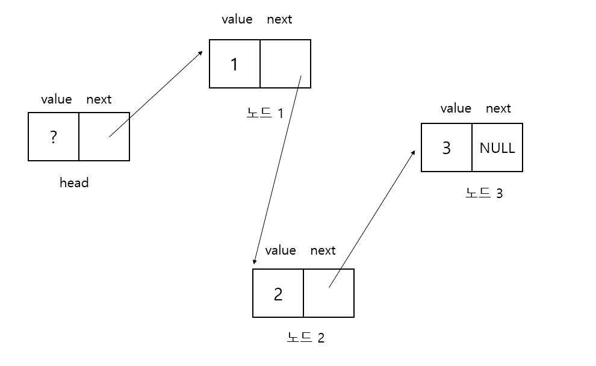

# 연결 리스트

## 단순 연결 리스트

연결 리스트와 동적 배열은 완전히 용도가 같은 자료 구조로서 서로 대체 가능하지만
구성 원리나 관리 방법은 질적으로 다르다. 연결 리스트의 대체 자료 구조는 배열이 아니라 동적 배열이다.


배열의 가장 큰 특징은 요소들이 물리적으로 인접한 메모리 영역에 연속적으로 배치된다는 점이다.

그래서 첨자 연산이 빠르고 메모리 요구량이 작은 대신 삽입 , 삭제가 번거롭다.
첨자 연산법이 단순해지기 위해서는 요소끼리 항상 인접해야 하고 그래서 삽입,삭제시에 요소들을
밀고 당기고  해야 하는 것이다. 연결 리스트는 요소들이 메모리의 도처에 흩어져서 존재하지만 
링크에 의해 논리적으로 연결되어 있어 링크를 따라가면 이전, 이후 요소들을 찾을 수 있다. 
삽입 , 삭제를 할 때도 물리적인 메모리 이동 없이 요소간의 링크만 조작하면 되므로 속도가 빠르다.

배열의 요소 하나는 자신이 기억할 데이터값만을 가지는데 비해  연결 리스트의 요소인 노드는
데이터외에 연결 상태에 대한 정보인 링크를 추가로 가져야 한다. 자기 다음의 요소가 누구인지를
스스로 기억하고 있어야 흩어져 있는 노드들의 순서를 알 수 있는데 이 연결 정보를 저장하는 것이 바로 링크이다.

링크를 하나만 가지는 것을 단순 연결 리스트라고 하고 두 개의 링크를 가지는 것을 이중 연결 리스트라고 한다.

노드를 구성하는 데이터와 링크는 타입이 다르기 때문에 노드는 이형 타입의 집합인 구조체로 정의된다.

```c
struct Node
{
    int value; // 데이터
    Node *next; // 링크
};
```

value 멤버는 노드가 기억하는 정보의 실체인 데이터이다.

next 멤버는 다음 노드에 대한 포인터를 가지는 링크이다. 

어떤 노드가 연결 리스트의 첫 번째 노드인지는 따로 저장해야 하는데 시작점을 기억하는 노드를 
머리(head)라고 한다. 일단 머리 노드를 알아야 연속적으로 다음 노드를 찾을 수 있으므로 머리 노드는
언제든지 참조할 수 있는 전역 변수로 선언하는 것이 보통이다.



노드들이 메모리 상의 임의 위치에 불규칙적으로 생성된다는 것을 강조하기 위해 노드의 위치도
불규칙적으로 그렸다. 
하지만 노드의 물리적인 위치가 어디인가는 중요하지 않고 실제 번지에 상관없이 링크에 의해 서로 논리적으로
연결되어 있으므로 일직선으로 그리는 것이 보통이다.


```c
#include "stdio.h"
#include "malloc.h"
#include "stdbool.h"

// 노드 구조체
typedef struct {
    int value;
    struct Node *next;
} Node;
Node *head;

// 연결 리스트 초기화 - 머리를 할당한다.
void InitList() {
    head = (Node *) malloc(sizeof(Node));
    head->next = NULL;
}

// Target 다음에 노드를 삽입한다.
Node *InsertNode(Node *Target, Node *aNode) {
    Node *New;

    New = (Node *) malloc(sizeof(Node));
    *New = *aNode;

    New->next = Target->next;
    Target->next = New;
    return New;
}

// Target 다음 노드르 삭제한다.
bool DeleteNode(Node *Target) {

    Node *Del;
    Del = Target->next;
    if (Del == NULL) { // Target 이 연결리스트의 마지막 노드이다.
        return false;
    }
    Target->next = Del->next;
    free(Del);
    return true;
}

// 연결 리스트의 모든 노드와 머리를 해제한다.
void UnInitList()
{
    while (DeleteNode(head)){;}

    free(head);
    head = NULL;
}

int main(void)
{
    Node *Now , Temp;

    InitList();

    // 다섯 개의 노드 삽입
    Now = head;
    for (int i = 1; i <= 5; ++i) {
        Temp.value = i;
        Now = InsertNode(Now, &Temp);
    }

    // 두 번째 노드 삭제
    DeleteNode(head -> next);

    // 순회하면서 출력
    for (Now = head -> next; Now; Now = Now -> next) {
        printf("%d\t", Now -> value);
    }
    printf('\n');
    UnInitList();
    
}
```

## 이중 연결 리스트

```c
struct Node{
    int value;
    Node *prev;
    Node *next;
};
```
노드에 저장되는 데이터 외에 앞쪽 노드의 번지를 가지는 prev 와 뒤쪽 노드의 번지를 가지는
next 링크가 포함되어 있다. 


```c
#include "stdio.h"
#include "malloc.h"
#include "stdbool.h"

typedef struct  {
    int value;
    struct Node *prev;
    struct Node *next;
}Node;

 Node *head;

// 연결 리스트 초기화 - 머리를 할당한다.

void InitList()
{
    head = (Node *) malloc(sizeof (Node));
    head -> prev = NULL;
    head -> next = NULL;
}

// 지정한 노드의 오른쪽에 삽입한다.
Node *InsertNodeRight(Node *Target, Node *aNode)
{
    Node *New;
    Node *Right;

    New = (Node *) malloc(sizeof(Node));
    *New = *aNode;
    Right = Target -> next;
    New -> next = Right;
    New -> prev = Target;
    Target -> next = New;
    if (Right) {
        Right-> prev = New;
    }
    return New;
}

// 지정한 노드의 왼쪽에 삽입한다.
Node *InsertNodeLeft(Node *Target , Node *aNode)
{
    Node *Left;
    Left = Target -> prev;
    if(Left) {
        return InsertNodeRight(Left,aNode);
    }
    return NULL;
}

// 제일 끝에 노드를 추가한다.
void AppendNode(Node *aNode)
{
    Node *tail;
    for(tail = head; tail->next; tail = tail -> next) {;}
    InsertNodeRight(tail,aNode);
}

// 단순 연결 리스트와는 달리 자기 자신을 지울 수 있다.
bool DeleteNode(Node *Target)
{
    Node *Left , *Right;

    // 헤더는 지울 수 없음
    if (Target == NULL || Target == head) {
        return false;
    }
    Left = Target -> prev;
    Right = Target -> next;

    Left->next = Right;
    if (Right) { // 타겟이 끝 노드일 경우
        Right->prev = Left;
    }
    free(Target);

    return true;
}

// idx 번째 노드를 찾는다.
Node *FindNodeByIndex(int idx)
{
    Node *Now;
    int index = 0;
    for(Now = head->next; Now; Now = Now->next) {
        if(index == idx) {
            return Now;
        }
        index++;
    }
    return NULL;
}

// 노드의 순서값을 구한다.
int GetNodeIndex(Node *Target) {
    Node *Now;
    int index = 0;
    for (Now = head->next; Now; Now = Now->next){
        if (Now = Target) {
            return index;
        }
        index++;
    }
    return -1;
}

// 노드의 개수를 구한다.
int GetListCount()
{
    Node *Now;
    int Count = 0;
    for (Now = head-> next; Now; Now = Now -> next) {
        Count++;
    }
    return Count;
}

// 연결 리스트의 모든 노드와 머리를 햐제한다.
void UnInitList()
{
    while (DeleteNode(head->next)) {;}
    free(head);
    head =NULL;
}

int main(void)
{
    Node *Now , Temp;
    InitList();

    for (int i = 1; i <= 5; ++i) {
        Temp.value = i;
        AppendNode(&Temp);
    }
    // 순회하면서 출력
    for (Now = head -> next; Now; Now = Now -> next) {
        printf("%d\t",Now -> value);
    }
    printf("\n");

    // 개수 , 데이터 3을 가진 노드와 앞 뒤 노드를 조사한다.
    printf("node count = %d\n",GetListCount());
    for (Now = head->next; Now; Now = Now->next) {
        if (Now->value == 3) break;
    }
    if (Now) {
        printf("Mid = %d , front Node = %d , back Node = %d \n", Now->value , Now->prev,Now->next);
    }
}
```