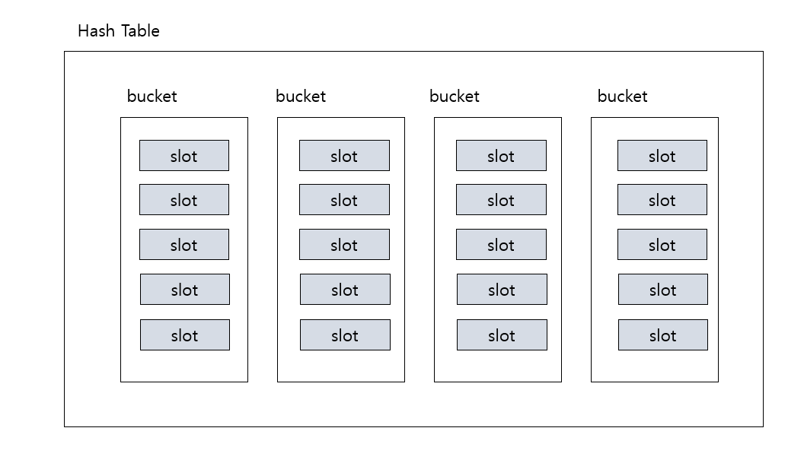

## 20.1.3 해시

배열은 인덱스를 이용하여 메모리의 각 요소의 주소를 계산해서 그 주소를 반환하기 때문에 단번에
목표 요소에 접근할 수 있다.

배열의 인덱스를 이용하여 데이터가 담길 주소를 계산하는 것처럼 데이터의 값을 잉요하여 각요소가 담길 주소를 계산하고
이 주소에 데이터를 담는다면 배열과 같은 수준의 성능을 얻을 수 있지 않을까??

해시는 데이터를 입력받으면 완전히 다른 모습의 데이터로 바꾸어 놓는 작업


해시의 용도

- 해시 테이블 : 해시 테이블은 데이터의 해시 값을 테이블 내의 주소로 이용하는 궁극의 탐색 알고리즘입니다.

- 암호화 : 해시는 입력받은 데이터를 완전히 새로운 모습의 데이터로 만든다고 했죠? 해시를 통해 변환된 데이터는 원본의 모습을 알아볼 수 없을 정도로 달라진다.
이 특성 때문에 해시는 암호화 영역에서 아주 주요하게 사용되고 있습니다. SHA(Secure Hash Algorithm) 알고리즘이 대표적인 예입니다.

- 데이터 축약 : 해시는 길이가 서로 다른 입력 데이터에 대해 일정한 길이의 출력을 만들 수 있습니다. 이 특성을 이용하면
커다란 데이터를 '해시'하여 짧은 길이로 축약할 수 있다. 이렇게 축약된 데이터끼리 비교를 수행하면 커다란 원본 데이터들을 비교하는 것에 비해
엄청난 효율을 거둘 수 있게 된다.


해시(Hash)는 자료를 입력할 때부터 검색하기 쉬운 위치에 삽입하는 방법이다.
따라서 해시는 검색 방법이라기보다는 빠른 검색을 위해 자료를 관리하는 기법이라고 볼 수 있다.

실생활에서도 해시 기법이 흔히 사용되는데 수첩에 주소록을 작성할 때 가나다순으로 페이지를 미리 분류하고 이름의 첫 글자를 
기준으로 주소를 적는 방법이 바로 해싱이다.

수첩에 아무렇게나 주소를 적어 놓으면 새 주소를 추가하기는 간편하지만 다음에 찾기가 무척 어려워 질 것이다.
하지만 성별로 분류해 놓으면 처음에 제 위치를 찾아 적기는 좀 귀찮지만 다음에 찾아보기는 쉬워진다.

자료가 저장되는 전체 저장소를 해시 테이블(Hash Table)이라고 한다.
해시 테이블은 여러 개의 버킷(Bucket)으로 나누어 지는데 

예를 들어 주소록에서 ㄱ , ㄴ ,ㄷ, ㄹ,각 페이지가 버킷이다. 
데이터를 삽입할 때 데이터의 값으로부터 적절한 버킷을 선택해서 삽입해야 한다.
버킷은 또한 여러 개의 슬롯(Slot)으로 구성되는데 슬롯은 버킷에 데이터가 저장되는 단위이다.

주소록의 각 페이지별로 한 명만 적을 수 있는 것이 아니라 여러 명을 적을 수 있어야 하는데
이때 한 명의 주소를 적는 칸이 슬롯이다.



해싱의 가장 기초적인 연산은 자료가 새로 입력될 때 이 자료를 어떤 버킷에 넣을지를 결정하는 것인데
이 연산을 하는 함수를 해시 함수라고 한다. 

해시 함수는 입력된 키값으로 버킷의 번호(해시 값)를 찾아내는 함수 인데 새로 자료를 삽입할 때
해시 함수가 리턴하는 버킷 번호에 자료를 삽입한다. 다음에 특정 자료를 검색할 때는 
다시 해시 함수로 버킷 번호를 찾아 여기에 원하는 자료가 있는지 보면 된다.

주소록 예에서 해시 함수는 이름의 첫 글자 자음으로부터 버킷 번호를 찾는다.
김 아무개는 ㄱ칸에, 장 아무개는 ㅈ칸을 찾아 선택된 버킷에 자료를 삽입하는 식이다.
이렇게 괸리되는 주소록에는 "장군"이라는 사람의 주소를 알고싶다면 "장군"을 다시 해시 함수로 넣어 ㅈ 버킷을 찾고
이 페이지만 검색하면 쉽게 찾을 수 있다.


```c++
#include "bits/stdc++.h"

#define BK 10
#define SL 1

using namespace std;

int hashtable[BK][SL];

int Hash(int key)
{
    return key % 10;
}

void AddKey(int key)
{
    int bucket;

    bucket = Hash(key);
//    cout << "버킷 번호 :" << bucket<< '\n';
    if (hashtable[bucket][0] == 0) {
        hashtable[bucket][0] = key;
    }
}

bool FindKey(int key) {
    int bucket;

    bucket = Hash(key);
    return (hashtable[bucket][0] == key);
}

int main()
{
    int key;
    memset(hashtable,0, sizeof(hashtable));
    for (int i = 0; i < 5; ++i) {
        cout << i+1 << "번째 값을 입력하세요 : ";
        cin >> key;
        AddKey(key);
    }
    cout << "검색할 키를 입력하세요 : ";
    cin >> key;
    if (FindKey(key)){
        puts("검색되었습니다.");
    }else {
        puts("입력하신 값은 없습니다.");

    }
}
```


 이러한 해시에도 여러 가지 문제점이 있는데, 가장 큰 문제는 버킷 끼리 충돌할 수 있다는 점이다.
 
새로 삽입하고자 하는 키의 버킷이 이미 점령되어 있다면 이 키는 해시 테이블에 추가할 수 없다.

버킷이 이미 정렬되어 값을 추가 할 수 없는 상황을 충돌(Collision) 이라고 한다.

## 다중 슬롯

```c
#include "bits/stdc++.h"

#define BK 10
#define SL 3

using namespace std;

int hashtable[BK][SL];

int Hash(int key)
{
    return key % 10;
}

void AddKey(int key)
{
    int bucket;

    bucket = Hash(key);
//    cout << "버킷 번호 :" << bucket<< '\n';
    for (int i = 0; i < SL; ++i) {
        if(hashtable[bucket][i] == 0) {
            hashtable[bucket][i] = key;
            break;
        }
    }
}

bool FindKey(int key) {
    int bucket;

    bucket = Hash(key);
    for (int i = 0; i < SL; ++i) {
        if(hashtable[bucket][i] == key){
            return true;
        }
    }
    return false;
}

int main()
{
    int key;
    memset(hashtable,0, sizeof(hashtable));
    for (int i = 0; i < 5; ++i) {
        cout << i+1 << "번째 값을 입력하세요 : ";
        cin >> key;
        AddKey(key);
    }
    cout << "검색할 키를 입력하세요 : ";
    cin >> key;
    if (FindKey(key)){
        puts("검색되었습니다.");
    }else {
        puts("입력하신 값은 없습니다.");
    }
}
```

## 정교한 해시 함수

해시 테이블이 아무리 커도 충돌은 발생할 수 있는데 이 충돌을 가급적 늦추고 버킷ㄱ을 골고루 사용하려면 키로부터
해시값을 찾는 해시 함수가 정교해야 한다. 나머지 연산자로 끝자리만 보는 간단한 방법은 균일한 해시 값을
만들어 내는데는 한계가 있다. 예를 들어 해시 테이블에 저장되는 데이터가 점수 값이라고 하자
문제가 100개가 아닌 한 점수는 보통 1단위인 경우보다 2나 4단위인 경우가 많은데 이렇게
되면 짝수 버킷에만 데이터가 몰리게 될 것이고 홀수 버킷은 텅텅 빌 것이다.
이렇게 되면 충돌이 금방 발생할 뿐만 아니라 기억 장소도 낭비된다.


정교한 해시 함수는 충돌을 최소화하고 기억 장소를 효율적으로 사용하는 방법 중 하나이기는 하지만
충돌을 근본적으로 해결하지는 못한다.

## 선형 탐색

슬롯이 넉넉하고 해시 함수가 정교해도 충돌은 언제나 발생할 가능성이 있다. 
그래서 충돌이 발생할 때의 대처 상황을 정의해야 하는데 선형 탐색법이 그 중 간단한 방법이다.

선형 탐색법(Linear Probing)은 충돌이 발생항 경우 이 데이터를 버리지 않고 다른 버킷에라도
대신 집어 넣는 방법이다.  근데 아무 곳에 넣으면 안되고 검색 함수가 찾을 수 있는 곳이어야 한다.

대체 버킷을 찾는 가장 간단한 방법은 바로 옆 칸에 적어 놓는 것이다. 그러면 검색 함수가 
버킷에서 찾지 못했을 때 옆 칸도 같이 찾아 볼 것이다.

```c
#include "bits/stdc++.h"

using namespace std;

#define BK 10
#define SL 1

int hashtable[BK][SL];

int Hash(int key) {
    return key % 10;
}

void AddKey(int key) {
    int bucket;

    bucket = Hash(key);
    while (hashtable[bucket][0] != 0) { // 해당 버킷에 slot 이 꽉 차있다면 (이미 값이 있다면)
        bucket = (bucket + 1) % 10;
    }

    hashtable[bucket][0] = key;
}

bool FindKey(int key) {
    int bucket;
    bucket = Hash(key);
    while (hashtable[bucket][0] != 0) {
        if (hashtable[bucket][0] == key) return true;
        bucket = (bucket + 1) % 10;
    }
    return false;
}

int main() {
    int key;
    memset(hashtable, 0, sizeof(hashtable));
    for (int i = 0; i < 5; ++i) {
        cout << i + 1 << "번째 값을 입력하세요 : ";
        cin >> key;
        AddKey(key);
    }
    cout << "검색할 키를 입력하세요 : ";
    cin >> key;
    if (FindKey(key)) {
        puts("검색되었습니다.");
    } else {
        puts("입력하신 값은 없습니다.");
    }
}
```

## 재해시

재해시도 선형 탐색법과 기본적으로 유사한 방법이다. 
선형 탐색법은 충돌 발생시 산술적인 연산으로 다른 칸을 찾지만 
재해시법은 대체 칸을 찾는 해시 함수를 별도로 하나 더 두는 방법이다.

```c
#include "bits/stdc++.h"

using namespace std;

#define BK 10
#define SL 1

int hashtable[BK][SL];

int Hash(int key) {
    return key % 10;
}

int Hash2(int key) {
    return (key / 10 + key % 10) % 10;
}

void AddKey(int key) {
    int bucket;

    bucket = Hash(key);
    if (hashtable[bucket][0] != 0) { // 이미 다른 값이 있음 (충돌이 발생했다면 ? )
        bucket = Hash2(key);
    }
    if (hashtable[bucket][0] == 0) {
        hashtable[bucket][0] = key;
    }
}

bool FindKey(int key) {
    int bucket;
    bucket = Hash(key);
    if (hashtable[bucket][0] == key) return true;

    bucket = Hash2(key);
    if (hashtable[bucket][0] == key) return true;
    return false;
}

int main() {
    int key;
    memset(hashtable, 0, sizeof(hashtable));
    for (int i = 0; i < 5; ++i) {
        cout << i + 1 << "번째 값을 입력하세요 : ";
        cin >> key;
        AddKey(key);
    }
    cout << "검색할 키를 입력하세요 : ";
    cin >> key;
    if (FindKey(key)) {
        puts("검색되었습니다.");
    } else {
        puts("입력하신 값은 없습니다.");
    }
}
```

Hash2 라는 해시 함수를 하나 더 정의하였다.

Hash 함수에서 해시 값을 찾는데 이 자리가 점령되어 있다면 Hash2 함수를 사용하여 대체 버킷을 찾은 뒤
값을 기록한다.

## 동적 슬롯 

동적 슬롯은 슬롯의 개수를 가변적으로 관리하는 방법이다. 선형 탐사나 재해시가 충돌을 회피하는 방법이라면
동적 슬롯은 충돌에 적극적으로 대처하는 방법이라고 할 수 있다. 최초 일정한 크기의 슬롯을 준비하되

만약 버킷이 가득찰 정도로 데이터가 들어온다면 슬롯 크기를 실행 중에 늘린다. 이렇게 하면 
대체 버킷을 찾을 필요가 없고 삭제하는 방법도 번거롭지 않다. 

슬롯은 실행 중에 크기를 늘릴 수 있어야 하므로 동적 배열이나 연결 리스트로 작성해야  한다.
동적 배열을 쓴다면 해시 테이블은 포인터 배열이 될 것이다.
연결 리스트라면 각 버킷이 슬롯 연결 리스트의 진입점인 head를 저장해야 할 것이다.

해싱은 해시 함수로부터 버킷의 위치를 바로 찾을 수 있으므로 검색 속도가 대단히 빠른 알고리즘 이지만
반면 메모리는 굉장히 많이 소모한다 . 크기와 속도가 항상 반비례라는 것을 잘 입증하는 알고리즘이다.

좀 더 빨라지고 싶으면 메모리를 충분히 준비해야 하고 메모리가 넉넉하지 않으면 잦은 충돌로 인해
느려질 수 밖에 없다. 