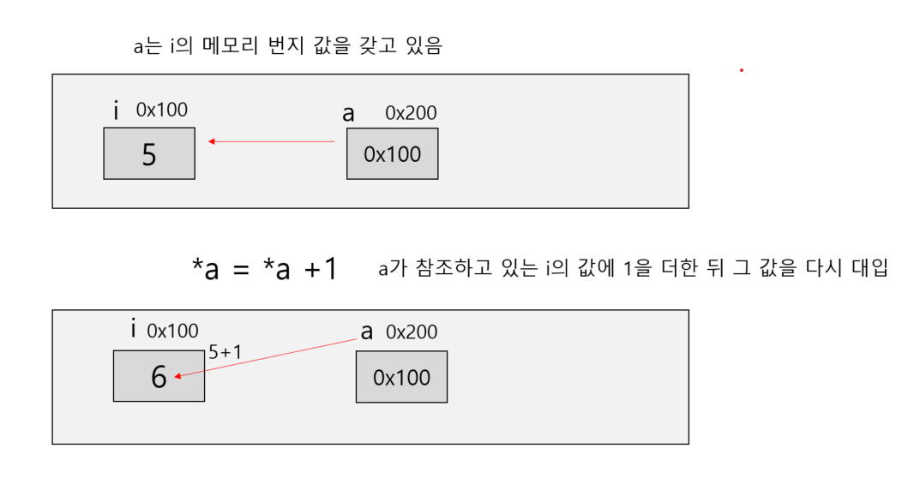

# 함수 호출 방식

## 값 호출

인수를 어떻게 전달하는가에 따라 값 호출 방식(call by value) 과 참조 호출 방식(call by reference)이 있다.

```c
#include "stdio.h"

int plusone(int a);

int main(void)
{
    int i,j;

    i = 5;
    j = plusone(i);
    printf("i=%d , 결과 = %d\n",i,j);
}

int plusone(int a){ // a는 i의 임시 사본이다.
    a += 1; // 형식 인수  a가 대입 받는 대상은 main 의 실인수 i
    return a;
}
```

plusone 함수 호출 시 전달되는 대상이 실인수 자체가 아니라 실인수의 값이기 때문에
이런 호출 방식을 값 호출이라고 한다. 
값 호출의 특징은 형식 인수가 함수 내에서 변경되더라도 실인수에는 전혀 영향을 미치지 못한다는 것이다.

## 참조 호출

```c++
#include "stdio.h"

int plusone(int *a);

int main(void)
{
    int i,j;
    i = 5;
    j = plusone(&i); // i의 메모리 주소 값을 전달 , 포인터 변수가 아니면 메모리 주소 값을 받을 수 없다.
    printf("i = %d , j = %d",i,j);
}
// a는 a가 가리키는 번지 주소이다.
int plusone(int *a){
    *a = *a +1; // *a는 a가 가리키고 있는 번지의 값을 말한다.
    return *a; 
}
```

값이 들어있는 번지를 주면 이 번지에 들어있는 값을 1 증가시킨다.



참조 호출이라는 말은 번지값을 전달받아 실인수를 직접 참조(reference)할 수 있다는 뜻이다.

값 호출과 참조 호출의 또 다른 차이점은 실인수로 상수를 전달할수 있는가 하는 점이다.
값 호출 방식은 값만 전달하기 때문에 plusone(5)과 같이 상수를 실인수로 사용할 수 있다.

그러나 참조 호출은 번지를 전달하기 때문에 번지를 가지는 변수만 사용할 수 있으며 상수는 사용할 수 없다.
상수는 메모리를 점유하고 있지 않기 때문에 번지가 없다. 즉, 상수는 좌변값이 아니며
참조 호출 함수의 실인수로는 좌변값만 사용할 수 있다.              


```c++
#include "stdio.h"

int main(void)
{
    int i, icopy;
    int *pi;

    i=5;
    icopy =i;
    icopy = icopy +1;
    printf("i = %d , icopy = %d \n",i,icopy); // i =5 , icopy = 6

    i =  5;
    pi = &i;

    *pi = *pi+1;
    printf("i = %d , *pi = %d",i,*pi); // i = 6 , *pi = 6
}
```